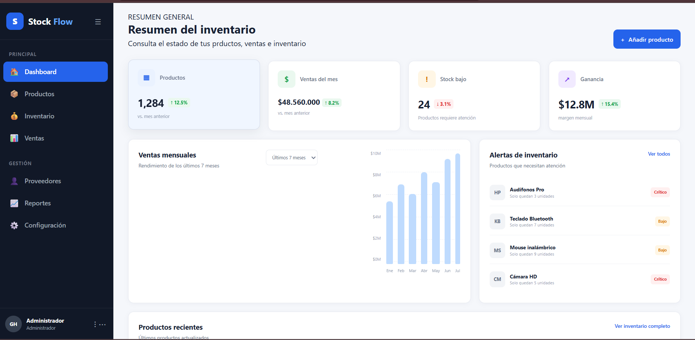
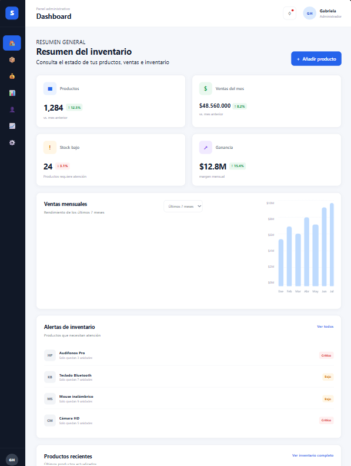
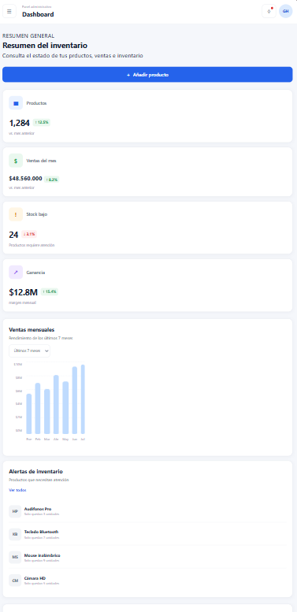

# StockFlow Dashboard

StockFlow es un dashboard administrativo desarrollado para la gestión y supervisión de inventario de una empresa.
El dashboard permite visualizar de manera rápida información relacionada con productos , ventas, ganancias y disponibilidad de inventario.
La interfaz está diseñada para facilitar la lectura de información y permitir que un administrador identifique rápidamente productos con bajo stock y consulte el comportamiento de ventas.

# Tecnologías utilizadas

- HTML5
- CSS3
- CSS Grid
- Flexbox
- Media Queries
- Variables CSS
- ARIA
- Git
- GitHub

# Componentes

1. Barra laetral de navegación
2. Encabezado superior
3. Tarjetas de indicadores principales
4. Gráfico de ventas mensuales
5. Panel de alertas de inventario
6. Tabla de productos
7. Footer informativo

# Decisiones de diseño

Se seleccionó una interfaz de administración de inventario debido a que permite organizar diferentes tipos de información en una misma vista.
La estructura utiliza una barra lateral oscura para separar la navegación del contenido principal. El área de contenido utiliza tarjetas blancas sobre un fondo neutro para establecer una jerarquía visual clara.
Los indicadores principales se presentan mediante tarjetas KPI ubicados en la parte superior del dashboard.Esto permite consultar rápidamente información relevante como cantidad de productos, ventas, stock bajo y ganancias.
El gráfico de barras se utiliza para representar las ventas mensuales, mientras que la tabla permite consultar información detallada de los productos.

# Capturas de pantalla

